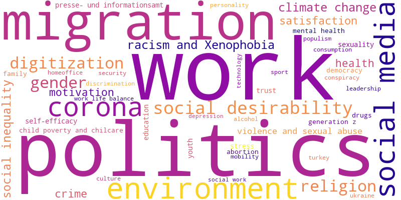

# MIRA - An LLM-Assisted Benchmark for Multi-Category Integrated Retrieval

**MIRA** dataset, a novel test collection designed to address the critical evaluation gap in multi-categorical information retrieval.
The modern search experience is integrated, yet IR benchmarks have lagged behind, constrained by a lack of collections that mirror this reality.
MIRA dataset directly confronts this challenge by providing a unified framework encompassing four distinct scholarly categories - **Publications**, **Research Data**, **Variables** and **Instruments & Tools** - all grounded in real user queries from the GESIS Search platform.

## Metadata Export
The collection contains metadata on 7,634 research datasets, 206,434 high-quality metadata variables, 604 instruments & tools, and 254,097 publications with a total of 468,769 documents, provided as a set of JSON files.

- **Metadata** : Download [metadata](https://drive.google.com/file/d/1jTTYd83bYTqeMB2DR4DSOWQQuYl4y_Sa/view?usp=drive_link) here.
   
- **Lucene Index** : The [Lucene (version 8)](https://drive.google.com/file/d/1i8U389G4wSj7dMz41xehKQvvBryZuIs-/view?usp=drive_link) index of the metadata can be accessed here.
  
- **Licence** : Check out the [licence information](license.txt) here.

## Topic Modeling

The initial pool of multi-category topics contained significant semantic overlap, as users frequently expressed core information needs through multiple query variants. Therefore, to group these variations, we performed topic modeling on the 412,032 pre-selected topics using **BERTopic** and ended up with 215 potential topics.
[Topic Modeling](topic_modelling) includes a Jupyter notebook that trains topic models for our corpus and produce artifacts (e.g. topic-term tables, document-topic distributions, etc.).

#### Prepare data
Create a CSV file (e.g., `queries.csv`) with a single text column:

<pre>csv 

text
"arbeitszufriedenheit"
"migration in Germany"
"global warming"
"right-wing extremism"
...
</pre>


#### What the pipeline does
- Embeds queries with sentence-transformers/paraphrase-multilingual-MiniLM-L12-v2
- Fits BERTopic to discover clusters/themes
- (Optional) Reduces/merges small/overlapping topics
- Exports topic summaries and per-document assignments
- Saves the model for reuse
- Creates a wordcloud based on topic frequencies

Word cloud of the [top 50 topics](topic_modelling/top-50-topics.tsv) derived from topic modeling is as follows.



## Topics

MIRA topics originate from real user queries submitted to the GESIS Search platform. We used user logs collected between 2017 and 2024, comprising 16,335,937 interactions. After filtering via topic modeling, we select 215 potential queries covering 4 categories. More details in the paper.

#### LLM-assisted Topic Curation
- We used `gpt-5-mini` to generate `description` and `narration` of each of the topic.
- For each topic, we provide LLM with top-scored 20 abstracts (obtained from GESIS search system) to generate the corresponding [description and narration](models/generate_query_narration.py).
- We used the following prompts.
 <pre> 
	|----------------------------------------------------------------------------------------------| 
	| Type        | Prompt                                                                         |
 	|-------------|--------------------------------------------------------------------------------|
	| Description | You are a helpful assistant generating description for keyword queries.        |
	|             | Write a short description (1–2 sentences) of the query in English. This        |
	|             | should summarize the information need clearly and concisely. An information    |
	|             | need is the underlying motivation or purpose that drives a person to seek      |
	|             | information — it represents the gap between what someone knows and what        |
	|             | they want or need to know in order to accomplish a goal.                       |
	|----------------------------------------------------------------------------------------------|
	| Narration   | You are a helpful assistant generating narration for keyword queries. Write    |
	|             | a English narrative in 4-5 sentences that explains what makes a document       |
	|             | relevant or non-relevant for this query. The narrative should include details, |
	|             | examples, and possible edge cases.                                             |
	|----------------------------------------------------------------------------------------------|
</pre>
- We create a [structured representation](models/make_query_trec_format.py) including the original topic and a full description along with a detailed narration of the final [215 topics](query_qrel/query.xml), which are distinct for each category following the standard TREC format. A sample query is given below.
  
```xml
<top>
<num>100</num>
<title>immigrant</title>
<publication>
	<desc>The user seeks an overview of research on immigrants’ integration and impacts in host societies. Specifically, they want evidence on how immigration policy frameworks and the composition of inflows shape native attitudes, labor market outcomes, welfare/crime perceptions, and political behavior across countries, and what policies best support integration.</desc>
	<narr>A document is relevant if it substantively focuses on immigrants as people residing in a receiving country—covering their experiences, integration, labor-market outcomes, health, legal treatment, political participation, or public attitudes/policy toward immigration (e.g., studies of EU8 immigrants in Germany, second-generation outcomes, or analyses of integrative vs restrictive policies). Morphological and related terms count when clearly about the same concept, such as immigration, immigrant-origin, first/second generation, or comparisons of refugees/economic migrants that speak to immigrant reception and impact. It is weakly or non-relevant if “immigrant” appears only in passing (titles, footnotes, metadata), is used metaphorically or in unrelated domains (e.g., “Immigrant Song,” animal “immigrants” in ecology), or discusses emigration/internal migration without linking to immigrants in a host society. Edge cases include country-specific policy evaluations, legal analyses of enforcement and criminalization, or media-framing studies—all relevant if immigrants are the core subject; by contrast, broad labor or cultural studies that do not distinguish immigrant status, or datasets where “immigrant” is incidental, are not. Even documents taking negative or positive stances, historical chapter outlines, or cross-national attitude surveys are relevant when immigrants are central to the research question.</narr>
</publication>
<research_data>
	<desc>The user seeks comprehensive surveys and datasets on immigrants and immigration in Germany and the EU, covering public attitudes, policy evaluation, skilled-worker migration, and immigrants’ integration and experiences, along with methodological and demographic details.</desc>
	<narr>A document is relevant to the query “immigrant” if it primarily discusses immigrants or immigration, such as public attitudes to immigration in Germany, integration outcomes, skilled worker admission, asylum/deportation policy, or survey-based findings on immigrant groups (e.g., ENTRA, EU MIDIS II, SCIP). Materials that present methods and demographics specifically for immigrant populations (e.g., sampling Italians, Poles, Syrians, Turks; second-generation studies), or analyze immigrant experiences like language acquisition, discrimination, labor market access, or party positions on immigration, also count as relevant. Items become weakly relevant or non-relevant when “immigrant” appears only tangentially within broad topics (e.g., general environment or rail-service modules) or when the primary focus is the general population with only a passing variable about immigrants. Edge cases include documents about refugees/asylum seekers or second-generation migrants, which are usually relevant if they address immigrant integration or policy; historical migration studies (e.g., 17th–20th century Berlin) are relevant if they focus on immigrant groups rather than generic mobility. Conversely, pieces centered on emigration from a country, generic “migration” without specifying immigrants in the destination, or where “immigrant” appears only in metadata or a single manifesto bullet without substantive analysis, are likely non-relevant.</narr>
</research_data>
<variables>
	<desc>A request for survey questions and public-opinion measures about immigrants, covering attitudes on assimilation and cultural impact, economic effects, crime and jobs, illegal immigration/exclusion, and different immigrant origins (e.g., Eastern Europe, south of the Mediterranean, EU asylum seekers). The user likely wants to find or analyze questionnaire items that measure acceptance of immigrants and perceived societal impacts.</desc>
	<narr>A document is relevant when immigrants are the central subject — for example when it contains survey items, policy statements, or analyses about immigrants’ economic, cultural, or legal impacts (e.g., questions on whether “immigrants increase crime rates,” “take jobs away,” “undermine culture,” or about “illegal immigrants” and “EU immigrants seeking political asylum”). Text that lists variable codes and repeated questionnaire items (Q9a, V52, v315–v318) is relevant if those codes map to substantive questions or responses, because it shows the document captures public attitudes and subgroup distinctions (Eastern Europe, South of the Mediterranean, other EU countries). A document is non‑relevant if “immigrant” appears only as a stray label, file code, or in an unrelated context (e.g., metadata, variable names with no question text), or if it actually discusses emigration, tourists, or student exchange rather than people settling. Edge cases include mixed or noisy transcripts (repeated lines, truncated items) and documents that mention immigrants but only in passing or at a different granularity (legal status vs cultural integration); relevance in those cases depends on whether the user cares about broad coverage of attitudes or only specific subtopics like asylum, crime, or labor market effects.</narr>
</variables>
<instruments_tools>
	<desc>The user seeks methods for classifying immigrant background in German survey data (especially the Microcensus 2005–2009) and for measuring immigrants’ educational attainment. They need guidance on coding schemes, survey instrument options, and SAS/SPSS/Stata implementations, including approaches used in SOEP and NEPS.</desc>
	<narr>A document is relevant to the query “immigrant” when it substantively addresses immigrants as a population—such as classification of immigrant background, integration, outcomes, or policies—rather than merely mentioning the term. The provided paragraph is clearly relevant because it centers on classifying immigrant background in the German Microcensus, measuring immigrants’ educational attainment, and survey instruments (SOEP/NEPS) tailored to people with foreign qualifications. Materials that use close synonyms or related constructs (migrants, foreign-born, immigration studies) also count, while pieces focused on emigration, internal/domestic migration, or unrelated uses (e.g., a film titled “The Immigrant”) are non-relevant. Methodological texts are relevant if immigrants are the primary analytic target (e.g., coding foreign credentials or deriving years of education for migrant respondents), but not if immigrants are only a passing example in a generic methods discussion. Edge cases include metadata-only hits or bibliographies where “immigrant” appears without substantive content about immigrant populations, which should be treated as non-relevant.</narr>
</instruments_tools>
</top>
```

## LLM-assisted Relevance Judgements
- For each of the 215 selected topics, we identified a pool of candidate documents to be judged.
- We select documents from all four categories that received a `view_record` or `download` or `export` user interaction after the query was issued in the GESIS Search.
- We used `gpt-5-mini` to judge those documents.
- Judgments were made on a graded relevance scale from '0' to '4'.
  - `0` → Not Relevant,
  - `1` → Marginally Relevant,
  - `2` → Fairly Relevant,
  - `3` → Highly Relevant, and
  - `4` → Perfectly Relevant
- We provided LLM with the `topic description` and the `document metadata`, instructing it to assess their relevance.
- We used the following [prompt](models/create_qrel_file.py) while assessing the documents by the LLM.
<pre>
	"You are a helpful assistant doing graded relevance assessment. Decide whether the given
	abstract is relevant to the keyword query. On a scale of 0 to 4, score the document where 
	'0' indicates non-relevant and '4' being the highly relevant."
</pre>
- Each judgment has 4 attributes - `topic_id`, `document_id`, `document_category`, `relevance_score`.
- We finally obtain a pool of `43,803` LLM-annotated [relevance judgments](query_qrel/qrels.tsv).
- A randomly chosen `40% sample` of the annotations were validated by human annotators.

## Evaluation

A number of statistical and neural models are [evaluated](evaluation/custom_eval.py) using standard IR metrics, such as P@100, nDCG@100, and Recall@100. Retreival effectiveness of each query can also be measured using this [script](evaluation/custom_eval_per_query.py).

